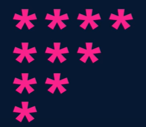
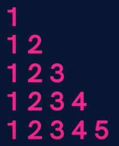
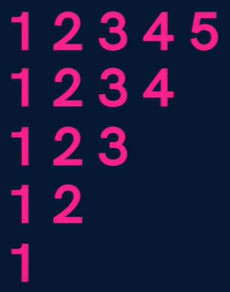
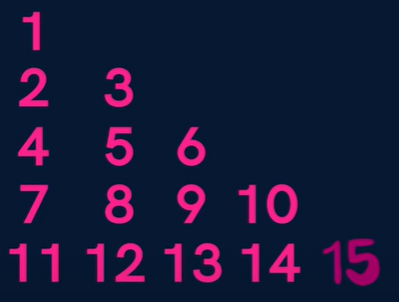

# [Lecture 5](https://www.youtube.com/watch?v=GjHNGM7KN3w&list=PLfqMhTWNBTe3LtFWcvwpqTkUSlB32kJop&index=5)
## Question 1 - Solid Rectangle
</img>
```java
  public class Lecture5Question1 {
    public static void main(String[] args) {
        for (int i = 1; i <= 4; i++){
            for (int k = 1; k <= 5; k++){
                System.out.print("*");
            }
            System.out.print("\n");
        }
    }
}
```
## Question 2 - Hollow Rectangle
</img>
```java
public class Lecture5Question2 {
    public static void main(String[] args) {
        int columns = 10;
        int rows = 10;
        for (int i = 1; i <= rows; i++) {
            for (int k = 1; k <= columns; k++) {
                if (i == 1 || i == rows || k == 1 || k == columns) 
                {System.out.print("*");} 
                else {System.out.print(" ");}}
            System.out.println();}}}
```
## Question 3 - Half Pyramid
</img>
```java
public class Lecture5Question3 {
    public static void main(String[] args) {
        int totalRows = 10;
        for (int row = 1; row <= totalRows; row ++ ){
            for (int column = 1; column <= row; column++){
                System.out.print("*");
            }
            System.out.println();
        }
    }
    
}
```
## Question 4 - Inverted Half Pyramid
</img>
```java
public class Lecture5Question4 {
    public static void main(String[] args) {
        int totalRows = 10;
        for (int row = totalRows; row >= 1; row -- ){
            for (int column = 1; column <= row; column++){
                System.out.print("*");
            }
            System.out.println();
        }
    }
}
```
## Question 5 - Inverted Half Pyramid Rotated by 180 Degrees
</img>
```java
public class Lecture5Question5 {
    public static void main(String[] args) {
        int totalRows = 10;
        for (int row = 0; row <= totalRows-1; row ++ ){
            for (int column = 0; column <= totalRows-1; column++){
                if (column >= totalRows-1-row){System.out.print("*");}
                else{System.out.print(" ");}
            }
            System.out.println();
        }
    }
}
```
## Question 6 - Half Pyramid With Numbers
</img>
```java
public class Lecture5Question6 {
    public static void main(String[] args) {
        int totalRows = 10;
        for (int row = 1; row <= totalRows; row ++ ){
            for (int column = 1; column <= row; column++){
                System.out.print(column);
            }
            System.out.println();
        }
    }
}
```
## Question 7 - Inverted Half Pyramid With Numbers
</img>
```java
public class Lecture5Question7 {
    public static void main(String[] args) {
        int totalRows = 9;
        for (int row = 1; row <= totalRows; row ++ ){
            for (int column = 1; column <= totalRows-row; column++){
                System.out.print(column);
            }
            System.out.println();
        }
    }
}
```
## Question 8 - Floyd's Triangle
</img>
```java
public class Lecture5Question8 {
    public static void main(String[] args) {
        int currentNumber = 1;
        int totalRows = 10;
        for (int row = 1; row <= totalRows; row ++ ){
            for (int column = 1; column <= row; column++){
                System.out.print(currentNumber+" ");
                currentNumber++;}
            System.out.println();
        }
    }
}
```
## Question 9 - Binary Triangle
</img>
```java
public class Lecture5Question9 {
    public static void main(String[] args) {
        int totalRows = 10;
        for (int row = 1; row <= totalRows; row ++ ){
            for (int column = 1; column <= row; column++){
                if ((row+column) % 2 == 0){System.out.print(1);}
                else{System.out.print(0);}
            }
            System.out.println();
        }
    }
}

```
