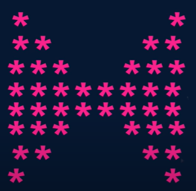
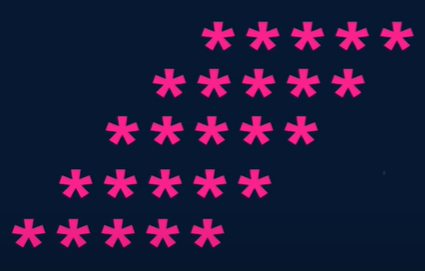
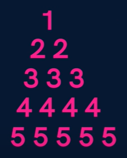
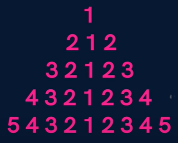
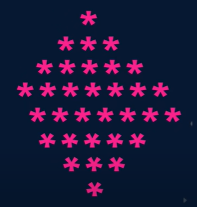

# [Lecture 6](https://www.youtube.com/watch?v=GjHNGM7KN3w&list=PLfqMhTWNBTe3LtFWcvwpqTkUSlB32kJop&index=6)
## Question 10 - Butterfly Pattern
</img>
```java
import java.util.Scanner;
public class Lecture6Question10 {
    public static void main(String[] args) {
        Scanner sc = new Scanner(System.in);
        int half = sc.nextInt();
        boolean reverse = false;
        int row = 1;
        while (row > 0){
            for (int column = 1; column <= half * 2; column++){
                if (column <= row || column > (half * 2) - row){System.out.print("*");}
                else{System.out.print(" ");}}
            System.out.println();
            if (row == half){reverse = true;}
            if (reverse == true){row--;}
            else{row++;}
        }
    }
}
```
## Question 11 - Solid Rhombus
</img>
```java
import java.util.Scanner;
public class Lecture6Question11 {
    public static void main(String[] args) {
        Scanner sc = new Scanner(System.in);
        int n = sc.nextInt();
        for (int i = 1; i <= n; i++) {
            for (int j = 1; j <= n - i; j++) {
                System.out.print(" ");
            }
            for (int j = 1; j <= n; j++) {
                System.out.print("*");
            }
            System.out.println();
        }
    }
}
```
## Question 12 - Number Pyramid
</img>
```java
import java.util.Scanner;
public class Lecture6Question12 {
    public static void main(String[] args) {
        Scanner sc = new Scanner(System.in);
        int n = sc.nextInt();
        for (int i = 1; i <= n; i++) {
            for (int j = 1; j <= n - i; j++) {
                System.out.print(" ");
            }
            for (int j = 1; j <= i; j++) {
                System.out.print(i + " ");
            }
            System.out.println();

        }
    }
}

```
## Question 13 - Palindromic Pattern
</img>
```java
import java.util.Scanner;
public class Lecture6Question13 {
    public static void main(String[] args) {
        Scanner sc = new Scanner(System.in);
        int n = sc.nextInt();
        for(int i=1; i<=n; i++) {
            for(int j=1; j<=n-i; j++) {System.out.print(" ");}
            for(int j=i; j>=1; j--) {System.out.print(j);}
            for(int j=2; j<=i; j++) {System.out.print(j);}
            System.out.println();
        }
    }
}
```
## Question 13 - Palindromic Pattern
</img>
```java
public class Lecture6Question14 {
    public static void main(String args[]) {
        int n = 5;
        for (int i = 1; i <= n; i++) {
            for (int j = 1; j <= n - i; j++) {System.out.print(" ");}
            for (int j = 1; j <= 2 * i - 1; j++) {System.out.print("*");}
            System.out.println();
        }
        for (int i = n; i >= 1; i--) {
            for (int j = 1; j <= n - i; j++) {System.out.print(" ");}
            for (int j = 1; j <= 2 * i - 1; j++) {System.out.print("*");}
            System.out.println();
        }
    }
}
```